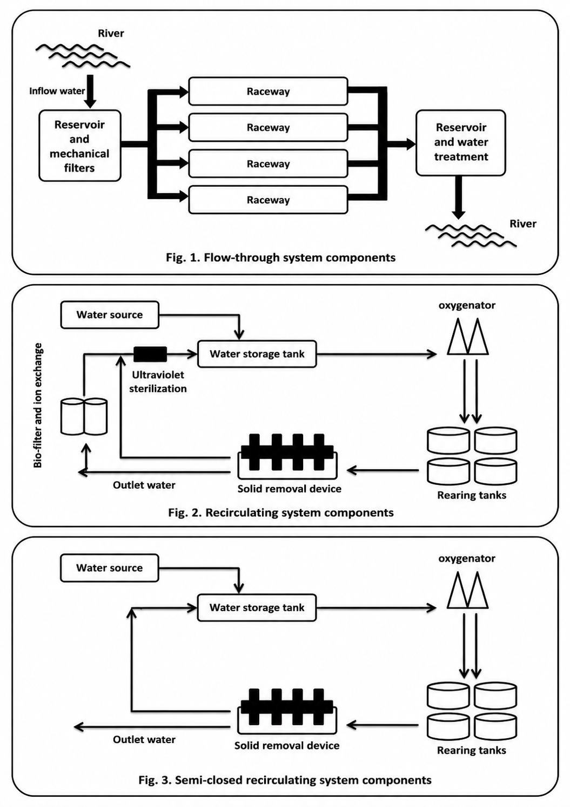
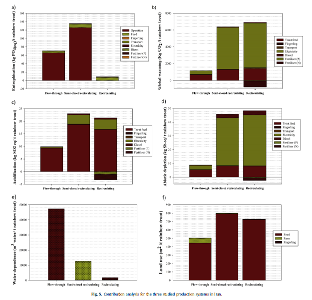
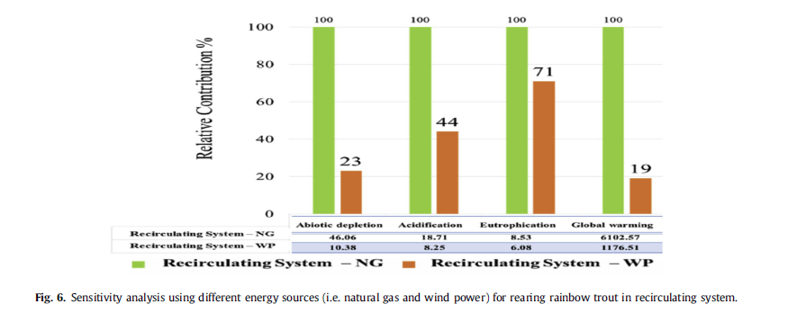

# Life Cycle Assessment of Rainbow Trout Production Systems

**Peer-reviewed comparative LCA | Aquaculture | SimaPro | ecoinvent | Sensitivity & Uncertainty Analysis**

This repository provides a concise technical summary of my peer-reviewed work on the environmental performance of alternative rainbow trout production systems.

> Dekamin, M., Veisi, H., Safari, E., Liaghati, H., Khoshbakht, K., & Dekamin, M.G. (2015).  
> *Life cycle assessment for rainbow trout (Oncorhynchus mykiss) production systems: a case study for Iran.*  
> Journal of Cleaner Production, 91, 43–55.  
> https://doi.org/10.1016/j.jclepro.2014.12.006

---

## Research Question

How do alternative rainbow trout production technologies differ in environmental performance when evaluated on a consistent life-cycle basis?

The study compared:

- flow-through production
- recirculating production
- semi-closed recirculating production

The objective was not only to calculate impacts, but also to identify environmental hotspots and evaluate opportunities for improving system performance.

---

## LCA Design

| Element | Study design |
|---|---|
| Functional unit | 1 metric tonne live-weight rainbow trout at farm gate |
| System boundary | Hatching to farm gate |
| Production systems | Flow-through, recirculating, semi-closed recirculating |
| Foreground inventory | Feed, energy, fingerlings, water, land and farm emissions |
| Background data | ecoinvent and published sources |
| Software | SimaPro 7.1 |
| LCIA approach | CML 2 Baseline 2000 midpoint |
| Key analyses | Contribution, sensitivity and uncertainty |
| Uncertainty | 1,000-run Monte Carlo analysis |

---

## System Boundary

The inventory distinguishes foreground production from upstream/background processes including feed raw-material production, feed manufacturing, fuels, electricity and transportation.

---

## Main Inventory Drivers

Major inputs included:

- feed and feed ingredients
- electricity
- diesel
- fingerlings
- transportation
- land
- water

Outputs included nutrient emissions to water and other farm-level emissions.

Energy demand varied sharply among production systems. The recirculating systems required considerably more electricity and diesel, while the flow-through system required substantially more water.

---

## Environmental Performance

The study evaluated multiple environmental dimensions rather than carbon alone, including:

- global warming potential
- acidification
- eutrophication
- abiotic resource depletion
- water dependence
- land use

For GWP100, reported results were approximately:

| Production system | GWP |
|---|---:|
| Flow-through | 1,157 kg CO2e/t live fish |
| Semi-closed recirculating | 6,380 kg CO2e/t live fish |
| Recirculating | 6,103 kg CO2e/t live fish |

The results also showed important tradeoffs. Flow-through production had lower energy-related impacts, while recirculating production sharply reduced water dependence and nutrient discharge.

---

## Hotspot / Contribution Analysis

Feed production and energy use emerged as major environmental hotspots.

In the flow-through system, feed production was the main contributor to several impact categories.

In the recirculating and semi-closed systems, electricity became a major driver of global warming and abiotic resource depletion because of the energy required for pumping, aeration and water treatment.

---

## Sensitivity Analysis

### Electricity Supply

The environmental performance of the recirculating system was highly sensitive to the electricity supply.

Replacing the modeled natural-gas-based electricity with wind electricity substantially reduced several environmental impacts.

The study also evaluated feed conversion ratio (FCR), showing that improved feed efficiency can materially reduce environmental burdens across production systems.

---

## Uncertainty

The study used Monte Carlo analysis in SimaPro with:

**1,000 runs and a 95% confidence interval**

to examine uncertainty associated with foreground and background inventory data.

This analysis was used to test the robustness of comparative conclusions rather than relying only on deterministic point estimates.

---

## Main LCA Lesson

The study demonstrates an important life-cycle principle:

> A technology that improves one environmental dimension can worsen another.

Recirculating systems substantially reduced water demand and local nutrient emissions, but their higher energy requirements increased several upstream environmental impacts under the modeled electricity mix.

This makes hotspot analysis, sensitivity analysis and interpretation essential parts of comparative LCA.

---

## What This Work Demonstrates

This peer-reviewed study demonstrates experience with:

**Goal & Scope → Functional Unit → System Boundary → LCI → LCIA → Contribution Analysis → Sensitivity → Monte Carlo Uncertainty → Interpretation**

Technical areas include:

- comparative LCA
- foreground/background inventory development
- agricultural and aquaculture supply chains
- SimaPro
- ecoinvent
- multi-impact LCIA
- hotspot analysis
- scenario and sensitivity analysis
- uncertainty analysis
- environmental tradeoff interpretation

---

## Publication

Dekamin, M., Veisi, H., Safari, E., Liaghati, H., Khoshbakht, K., & Dekamin, M.G. (2015).

*Life cycle assessment for rainbow trout (Oncorhynchus mykiss) production systems: a case study for Iran.*

**Journal of Cleaner Production, 91, 43–55.**

https://doi.org/10.1016/j.jclepro.2014.12.006

---

## Related Work

See my broader **Life Cycle Assessment Portfolio** for applications across agriculture, renewable fuels, construction materials, packaging, EPD methodology and sustainability decision analytics.
